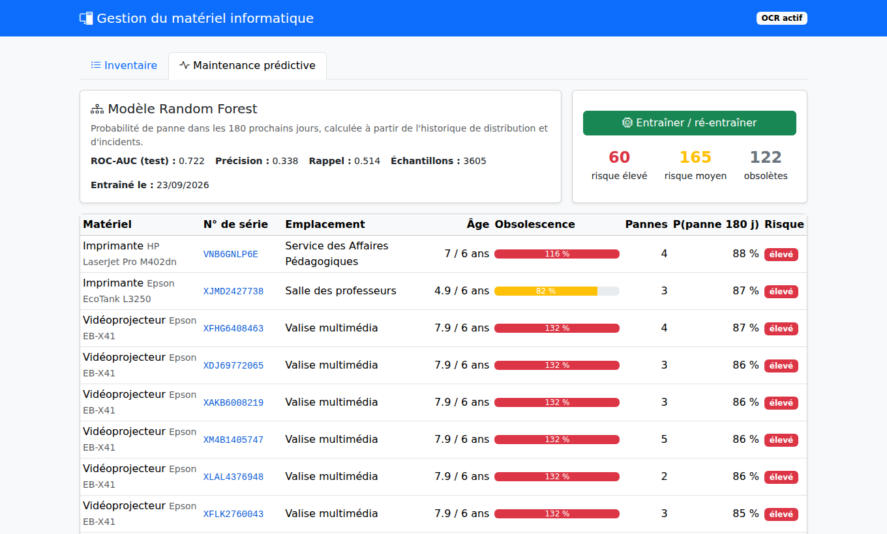
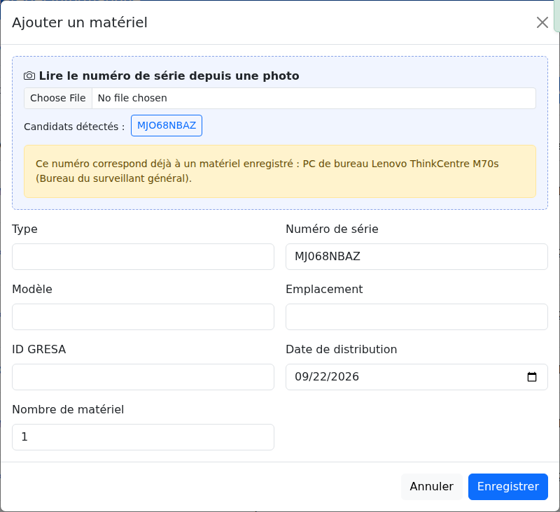
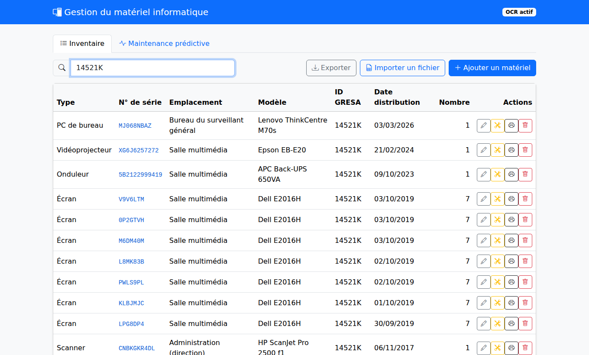
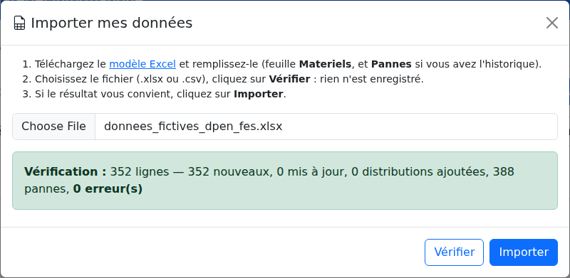
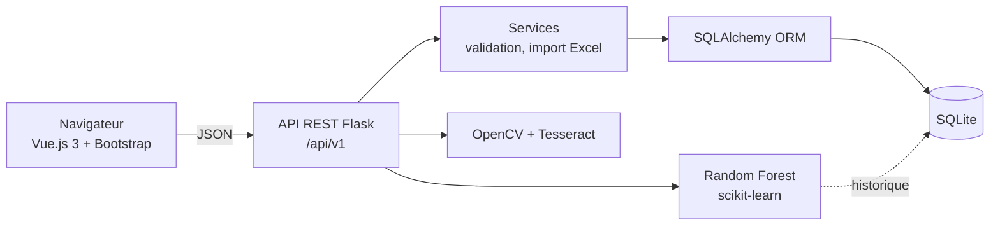

# Gestion du parc informatique — IA de maintenance prédictive & OCR


Application web de gestion du matériel informatique distribué par une **Direction Provinciale de
l'Éducation Nationale** (Fès, Maroc) à ses établissements scolaires : inventaire, historique des
affectations, **prédiction des pannes par machine learning** et **saisie des numéros de série par
photo (OCR)**.

> **Contexte.** Au sein d'une direction provinciale, le suivi de centaines d'ordinateurs,
> vidéoprojecteurs et imprimantes répartis dans les établissements se fait souvent sur papier :
> saisies longues, erreurs de recopie, aucune visibilité sur l'état du parc. Cette application
> centralise l'inventaire et aide à anticiper les pannes et les renouvellements.

---

## Aperçu

| Maintenance prédictive | Lecture OCR d'une étiquette |
|---|---|
|  |  |
| Chaque matériel reçoit une **probabilité de panne à 6 mois** et un **taux d'obsolescence** ; le parc est classé par priorité d'intervention. | Photo de l'étiquette → numéro de série extrait. L'OCR lit `MJO68NBAZ` (lettre O) : l'application **corrige automatiquement** en `MJ068NBAZ` grâce à la base et signale le doublon. |

| Inventaire | Import de données Excel |
|---|---|
|  |  |

*Données de démonstration fictives : 352 matériels, 16 établissements, 388 pannes sur 10 ans.*

---

## Fonctionnalités

| Fonctionnalité | Description | Technologies |
|---|---|---|
| **Prédiction des pannes** | Estime pour chaque appareil le risque de panne dans les 6 prochains mois et signale les appareils trop vieux | scikit-learn (Random Forest) |
| **Lecture de photo** | Lit automatiquement le numéro de série sur une photo de l'étiquette | OpenCV, Tesseract (OCR) |
| **Inventaire** | Ajouter, modifier, rechercher et imprimer les fiches du matériel, avec l'historique des pannes et des affectations | Flask, SQLAlchemy |
| **Import / export Excel** | Ajouter des centaines d'appareils d'un coup depuis Excel, avec vérification des erreurs avant l'import | pandas |
| **Interface web** | Pages dynamiques qui se mettent à jour sans rechargement | Vue.js, Bootstrap, API REST |
| **Sécurité** | Protection contre les injections SQL, secrets hors du code, vérification des saisies | SQLAlchemy, .env |
| **Déploiement** | Lancement en une commande sur n'importe quel ordinateur, tests automatiques à chaque mise à jour | Docker, GitHub Actions, pytest |

---

## Le modèle de maintenance prédictive

**Question posée :** *ce matériel va-t-il tomber en panne dans les 6 prochains mois ?*

**Variables** calculées uniquement à partir du passé : type de matériel, âge, nombre d'affectations
(déplacements), ancienneté de la dernière affectation, taille du lot, nombre de pannes passées,
ancienneté de la dernière panne.

**Méthodologie :**
- **Snapshots temporels** — le parc est « photographié » à 12 dates passées (tous les 90 jours) ;
  pour chaque date, la cible est la survenue d'une panne dans les 180 jours suivants. Aucune
  information future n'est utilisée (vérifié par un test unitaire).
- **Split train/test par matériel** — un même équipement n'apparaît jamais dans les deux jeux.
- `RandomForestClassifier` (300 arbres, `class_weight="balanced"` car les pannes sont minoritaires)
  dans un `Pipeline` scikit-learn avec `OneHotEncoder`.

**Résultats** (données de démonstration, taux de panne 13 %) :

| ROC-AUC | Précision (panne) | Rappel (panne) |
|---|---|---|
| 0,72 | 0,34 | 0,52 |

Choix assumé de privilégier le **rappel** : en maintenance, inspecter un appareil sain coûte moins
cher que manquer une panne. Variables les plus importantes : âge, ancienneté de la dernière
affectation, historique de pannes.

Un **indicateur d'obsolescence** (âge / durée de vie de référence par type) complète la prédiction
et reste disponible même sans historique de pannes.

## Le module OCR

1. Redimensionnement, niveaux de gris, **filtre bilatéral** (débruitage en préservant les contours)
2. **Redressement automatique** de l'étiquette (± 15°) par `minAreaRect`
3. Trois binarisations (Otsu, adaptative, inversée) × deux modes de segmentation Tesseract
4. Extraction des candidats par **expressions régulières** (`S/N`, `Serial No`, `N° de série`…)
   et classement par score (mot-clé détecté × confiance Tesseract)
5. **Rapprochement tolérant avec la base** : `O↔0`, `I↔1`, `S↔5`, `B↔8`… → correction et
   détection de doublon

Des étiquettes de test sont fournies dans [`docs/exemples_ocr/`](docs/exemples_ocr/).

---

## Lancer le projet

### Avec Docker (recommandé — rien d'autre à installer)

```bash
git clone https://github.com/Aya-Bouchama/gestion-parc-informatique.git
cd gestion-parc-informatique
cp .env.example .env
docker compose up -d --build
docker compose exec web flask --app wsgi import-donnees donnees_fictives_dpen_fes.xlsx
docker compose exec web flask --app wsgi ml-train
```

→ <http://localhost:8000>

### Sans Docker

Prérequis : Python 3.10+ ; [Tesseract](https://github.com/UB-Mannheim/tesseract/wiki) pour l'OCR (facultatif).

```bash
python -m venv venv
venv\Scripts\activate                 # Linux/macOS : source venv/bin/activate
pip install -r requirements-dev.txt
cp .env.example .env                  # Windows : copy ; renseigner TESSERACT_CMD si besoin
flask --app wsgi import-donnees donnees_fictives_dpen_fes.xlsx
flask --app wsgi ml-train
python run.py                         # http://127.0.0.1:5000
pytest -q                             # tests
```

La base est un fichier **SQLite** (`data/gestion.sqlite3`) créé automatiquement.

---

## Architecture



```
app/
├── __init__.py          application factory, gestion d'erreurs, en-têtes de sécurité
├── config.py            configuration par variables d'environnement
├── models.py            Materiel · Etablissement (historique d'affectation) · Panne
├── services/            logique métier, validation, import/export Excel
├── api/routes.py        API REST
├── ml/maintenance.py    features, entraînement, prédiction
├── ocr/serial_ocr.py    prétraitement d'image, OCR, extraction
├── cli.py               commandes : import-donnees, ml-train, seed-demo, modele-import
├── templates/ static/   interface Vue.js (bibliothèques embarquées : fonctionne hors ligne)
tests/                   23 tests pytest
Dockerfile · docker-compose.yml · .github/workflows/tests.yml
```

### Principales routes de l'API

| Méthode | Route | Rôle |
|---|---|---|
| GET/POST | `/api/v1/materiels` | Liste (recherche `?q=`) / création |
| GET/PUT/DELETE | `/api/v1/materiels/<id>` | Détail avec historique / modification / suppression |
| POST | `/api/v1/materiels/<id>/pannes` | Déclaration de panne |
| POST | `/api/v1/materiels/<id>/distributions` | Nouvelle affectation (historique conservé) |
| GET | `/api/v1/maintenance/predictions` | Risque de panne et obsolescence du parc |
| POST | `/api/v1/maintenance/entrainer` | (Ré)entraînement du modèle |
| POST | `/api/v1/ocr/numero-serie` | OCR d'une photo (`multipart`, champ `image`) |
| POST | `/api/v1/import?simulation=1` | Import Excel/CSV (vérification à blanc possible) |
| GET | `/api/v1/export` | Export Excel complet |

---

## Utiliser ses propres données

Remplir [`modele_import_materiel.xlsx`](modele_import_materiel.xlsx) (feuilles **Materiels** et
**Pannes**), puis dans l'application : **Importer un fichier → Vérifier → Importer**. Les noms de
colonnes sont tolérants (« N° de série », « Code GRESA »…) ; un réimport met à jour les matériels
existants sans créer de doublons.

## Limites et pistes

- Les métriques du modèle sont obtenues sur des **données simulées** ; elles devront être
  recalculées sur l'historique réel des pannes.
- **Pas d'authentification** : application prévue pour un intranet. Étape suivante : comptes
  utilisateurs et rôles (Flask-Login / JWT), HTTPS derrière un reverse proxy.
- OCR : ajout de la lecture des **codes-barres / QR codes** (pyzbar), souvent présents sur les étiquettes.
- Modèle : essai de modèles de survie (durée avant panne) et de gradient boosting.

---

**Aya Bouchama** 
